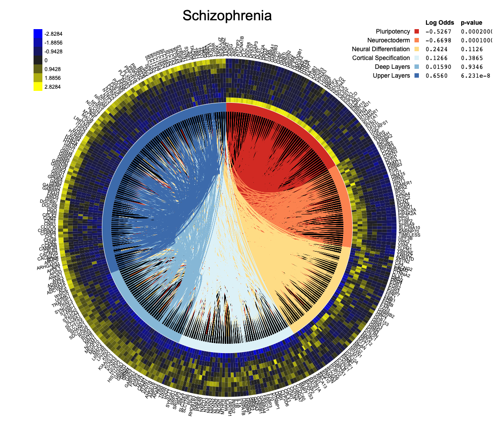

```{r setup, include=FALSE}
# Required R package installation:
# These will install packages if they are not already installed

# Set the correct default repository
r = getOption("repos")
r["CRAN"] = "http://cran.rstudio.com"
options(repos = r)

if (!require("ggbiplot")) {
   devtools::install_git("https://github.com/vqv/ggbiplot.git")
   library(ggbiplot)
}
if (!require("ggplot2")) {
  install.packages("ggplot2")
  library(ggplot2)
}
if (!require("knitr")) {
  install.packages("knitr")
  library(knitr)
}

if (!require("matlab")) {
   install.packages("matlab")
   library(matlab)
}

if (!require("scatterplot3d")) {
  install.packages("scatterplot3d")
  library(scatterplot3d)
}

if (!require("gplots")) {
  install.packages("gplots")
  library(gplots)
}

if (!require("fields")){
  install.packages("fields")
  library(fields)
}


if (!require("tibble")) {
  install.packages("tibble")
  library(tibble)
}

if (!require("dplyr")) {
  install.packages("dplyr")
  library(dplyr)
}

if (!require("tidyr")) {
  install.packages("tidyr")
  library(tidyr)
}

if (!require("hablar")) {
  install.packages("hablar")
  library(hablar)
}

if (!require("kaleExtra")) {
  install.packages("kableExtra")
  library(kableExtra)
}


knitr::opts_chunk$set(echo = TRUE)
```


# 0. Introduction

Juicy Insights (Jared Gridley, Shane Boles, Dan Stevens, John Allwein, David Qiu, Zachary Wood)
We will be examining the window of suspecibility for Microcephaly and Zika-induced microcephaly in mice. We will then perform a similar WOS analysis on another brain disorder in mice.
Give your company name and members.  Discuss the problem you are addressing. 

# 1. Stages of Development Analysis
Loading in the Data
```{r}
# Read in the data and create a dataframe
# We read in the csv indicating that we have row names. 
Mouse.df <-read.csv("~/MATP-4400/data/MouseHomologData.csv", row.names = 1) 

# Use shorter column names
colnames(Mouse.df)<-c("-8","-4","0","1","7","16","21","28")

# Create a matrix for our analysis
Mouse.matrix <- as.matrix(Mouse.df)
# Summarize; note the scaling
summary(Mouse.df)


```
Cluster and PCA Analysis

```{r}
set.seed(300)
km <-kmeans(Mouse.matrix, 5)

# Calculate the PCA
my.pca <- prcomp(Mouse.matrix, retx=TRUE, center=TRUE, scale=TRUE)
# Summarize, to see the complete PCA result
summary(my.pca)

```

Determining Stage ordering by examining the cluster means.
```{r}
tics<-c(-8,-4,0,1,7,16,21,28) # x-axis "tics" (for the plot)
clustermean<-km$centers # Extract the cluster means from km

# Set up ggplot-based line plot 
# We must "pivot" at dataframe version of clustermean (ie convert from "wide" to "long")
# Rows are our groups
clustermean.df <- as.data.frame(clustermean, row.names = c("1", "2", "3", "4", "5"))

# Tidyverse pipeline
# This is making a data frame of the  form
# Cluster Day Mean

clustermeanlong.df <- clustermean.df %>% 
  rownames_to_column("Cluster") %>% #  Make a new column called Cluster
  gather(key="Day",value="Mean", -Cluster) %>% # Make a skinny data frame
  convert(int(Day))
  #Recode the factors to have short names
 # mutate(Day=recode(Day,"DayNeg8"="-8","DayNeg4"="-4","Day0"="0", "DayPos1"= "1",
 #       "DayPos7"= "7", "DayPos16"= "16","DayPos21"= "21", "DayPos28"= "28"))%>%
# see what data frame looks like., 
kable(head(clustermeanlong.df))
 

  #Plot the mean of each cluster in a separate graph":
  ggplot(clustermeanlong.df,aes(x=Day, y=Mean, col=Cluster)) +
  geom_line() + 
  geom_point() +
  scale_x_continuous(breaks=tics) +
  labs(title="Cluster Centers") +
  # Use facet_wrap to make a separate plot for each cluster
  facet_wrap(Cluster ~.)

```
Now that we know that the ordering should be 1 = C, 2 = A, 3 = E, 4 = B, 5 = D, we can make relabel the data and make the biplot.
```{r}
#Relabeling the Cluster Data
cluster.df <- as.data.frame(km$cluster) 
colnames(cluster.df) <- c("Clusters")
labeled_clusters.df <- cluster.df %>% mutate(Clusters=recode(Clusters, `1` = "C", `2`="A", `3`="E", `4`="B", `5`="D"))

# Calculate x and y scale limits for the biplot
t<-1.2*max(abs(my.pca$x[,1:2]))
# Generate the biplot using ggbiplot
p <- ggbiplot(my.pca,
            choices=c(1,2),  # Use PC1, PC2
            alpha=.1,        # Make dots transparent
            varname.adjust=1.5,  # Move variables names out a bit
            scale =0,
            groups=as.factor(labeled_clusters.df$Clusters))       # Don't rescale data
p + ggtitle('Mouse Biplot for PC1 and PC2') + xlim(-t,t) + ylim(-t,t) # title plot and make square

```


Heatmap:
We can see the diagonal of yellow squares, indicating that there are distinct genes activated during each of the 5 stages.
```{r}
row.names(km$centers) = c("C", "A", "E", "B", "D")

set.seed(300)
heatmap.2(km$centers, 
          scale = "none",
          dendrogram = "none",
          Colv=FALSE,
          cexCol=1.0,
          main = "Kmeans Cluster Centers",
          trace ="none")
```


# 2. Windows of Susceptibility Analysis of Zika
Loading in the data
```{r}
zika.df <-read.csv("~/MATP-4400/data/Zikamicrocephaly_data.csv",row.names = 1)

# Making the rownames "searchable"
zika_symbols <- intersect(as.character(zika.df$symbol), as.character(rownames(Mouse.df)))
zika_data.df <- Mouse.df[zika_symbols,]

#Getting the specific PCA variables for Zika
zika_pca.x.df <- as.data.frame(my.pca$x[zika_symbols,])
zika_pca.rotation.df <- as.data.frame(my.pca$rotation)

#Getting the zika kmeans
zika_km.cluster <- km$cluster[zika_symbols]
zika_km.centers <- km$centers


# Adding cluster to data df and x:
zika_data.df$Cluster <- zika_km.cluster
zika_pca.x.df$Stage <- zika_km.cluster

#This will make it easier to color in the biplot
zika_pca.x.color.df <- zika_pca.x.df %>% mutate(Stage = recode(Stage, `1` = "C", `2` = "A", `3`="E", `4`="B", `5`="D"))

# Converting DF to matrix
# zika_matrix <- as.matrix(zika_data.df)
```

Making the Biplot with ggplot.
```{r}
ggplot() +
  geom_point(data = zika_pca.x.color.df, 
             mapping = aes(x = PC1, y = PC2, color = Stage)
             )+
  geom_segment(data = zika_pca.rotation.df, 
               mapping = aes(x = 0, y = 0, xend = PC1*2, yend = PC2*2), 
               arrow = arrow(length = unit(1/2, 'picas')))+
  geom_text(data = zika_pca.rotation.df,
            mapping = aes(x = PC1*2.2, y = PC2*2.2, label = c(row.names(zika_pca.rotation.df))))+
  xlim(-3, 3)+
  ylim(-3,3)+
  labs(title = "Zika Mouse data - PC1 and PC2") + xlab("PC1 (51.8% Explained Var.)") + ylab("PC2 (22.1% Explained Var.)")

```

Now, lets analyze these P-values and logOdds ratios!

Function to help calculation the P-value and Logodds
```{r}

# Define cluster_pvals; DO NOT CHANGE!
cluster_pvals <- function(k, km, myplot.df) {
  # Inputs: k, km, myplot.df 
  # Returns: results (dataframe with clusters, pvalues, logodds)
  # Set the p-value and logodds to 0
  pvalue <- zeros(k,1)
  logodds <- zeros(k,1)
  results <- cbind.data.frame(cluster=1:k, pvalue, logodds)
  classdisease <- zeros(k,1)
  classall <- as.vector(table(km$cluster))
  # use dplyr to calculate counts for each cluster 
  temp <- myplot.df %>% 
        dplyr::group_by(cluster) %>% 
        dplyr::count(name="freq")  # Creates 'freq' column!
  classdisease[temp$cluster] <- temp$freq
  classlogodds <- zeros(k,2)
  totaldisease <- sum(classdisease)
  totalall <- sum(classall)
  # Calculate the log odds ratio for the disease
  for (i in 1:k) {
     n11 <- classdisease[i] +1 # genes in disease in cluster i 
     n21 <- totaldisease- classdisease[i] +1 # genes in disease not in cluster i
     n12 <- classall[i]-n11+1 # genes not in disease and in cluster i
     n22 <- totalall- n11-n21 -n12+1; # genes not in disease and not in cluster 
     res <- fisher.test(matrix(c(n11,n21,n12,n22), 2, 2))
    results[i,]$pvalue <- res$p.value
    results[i,]$logodds<- log((n11*n22)/(n12*n21))
  }
  return(results)}
```

Using the helper function to display the results for the p-value and logodds
```{r}
# Applying the Helper Function and display the results

plot.df <- cbind.data.frame(zika_pca.x.df, cluster=as.factor(zika_pca.x.color.df$Stage))

# Apply cluster_pvals using the parameters just generated
Z_clusters <- cluster_pvals(5, km, plot.df)

threshold <- 0.1  # Normally set to 0.1

# Evaluate across our results; create new column
Z_clusters <- 
  Z_clusters %>% 
  mutate(enriched = if_else(pvalue <= threshold & logodds > 0, TRUE, FALSE))

# View results
kable(Z_clusters) %>% kable_styling()
```
We can see that cluster 4 is enriched (more analysis in conclusion section)


# 3. Windows of Susceptibility Analysis of Schizophrenia
Swot Plot for Schizophrenia:
```{r out.height = '60%'}

```
Based on the SWOT plot, it appears that there may be a window of suspectibility during the Pluripotency stage of development as indicated by the nearly solid yellow line. For the rest of the graph, it is much or spread out, there looks to be less of a hard cut of between stages, and more of a flow between them to the point where differentiating the stages is difficult. This would indicate less of a single particularly susceptible stage and more of a possibility that it has many causes throughout each stage. 

Loading in the data
```{r}
S.df <-read.csv("~/IDM_work/Lab5/Schizophrenia_heat_map_data.csv",row.names = 1)
S_symbols <- intersect(as.character(S.df$symbol), as.character(rownames(Mouse.df)))


#Getting the specific PCA variables for Schizophrenia
S_pca.x.df <- as.data.frame(my.pca$x[S_symbols,])
S_pca.rotation.df <- as.data.frame(my.pca$rotation)

#Getting the zika kmeans
S_km.cluster <- km$cluster[S_symbols] 
S_km.centers <- km$centers


# Adding cluster to data df and x:
S_pca.x.df$Stage <- S_km.cluster

#This will make it easier to color in the biplot
S_pca.x.color.df <- S_pca.x.df %>% mutate(Stage = recode(Stage, `1` = "C", `2`="A", `3`="E", `4`="B", `5`="D"))

```

Data Visualization (Yay!)

Biplot Time!
```{r}

ggplot() +
  geom_point(data = S_pca.x.color.df, 
             mapping = aes(x = PC1, y = PC2, color = Stage)
             )+
  geom_segment(data = S_pca.rotation.df, 
               mapping = aes(x = 0, y = 0, xend = PC1*2, yend = PC2*2), 
               arrow = arrow(length = unit(1/2, 'picas')))+
  geom_text(data = S_pca.rotation.df,
            mapping = aes(x = PC1*2.2, y = PC2*2.2, label = c(row.names(S_pca.rotation.df))))+
  xlim(-3, 3)+
  ylim(-3,3)+
  labs(title = "Schizophrenia Mouse data - PC1 and PC2") + xlab("PC1 (51.8% Explained Var.)") + ylab("PC2 (22.1% Explained Var.)")

```
Cluster to Stage Relationship: 1 = C, 2 = A, 3 = E, 4 = B, 5 = D

Using the helper function to display the results for the p-value and logodds
```{r}
# Applying the Helper Function and display the results

plot.df <- cbind.data.frame(S_pca.x.df, cluster=as.factor(S_km.cluster))

# Apply cluster_pvals using the parameters just generated
S_clusters <- cluster_pvals(5, km, plot.df)

threshold <- 0.1  # Normally set to 0.1

# Evaluate across our results; create new column
S_clusters <- 
  S_clusters %>% 
  mutate(enriched = if_else(pvalue <= threshold & logodds > 0, TRUE, FALSE))

# View results
kable(S_clusters) %>% kable_styling()
```
By looking at the pvalues and logodds, we can see that Clusters 3 and 5 are enriched. 


# 4. My Creative Analysis
Zika:

First I want visualize the Enrichment determination using a simple plot. The enriched clusters are labeled.
```{r}
ggplot(data = Z_clusters, aes(x = pvalue, y = logodds, color = enriched)) + 
  geom_point(aes(size = logodds, shape = enriched)) + 
  geom_text(aes(label=ifelse(logodds>0, cluster, '')),hjust=-1.5, vjust=0) + 
  labs(title = "Zika Enrichment Graph")

row.names(Z_clusters) = c("C", "A", "E", "B", "D")
set.seed(300)
heatmap.2(as.matrix(Z_clusters[,2:4]), 
          scale = "col",
          dendrogram = "none",
          Colv=FALSE,
          cexCol=1.0,
          main = "Enrichment Heatmap (Zika)",
          trace ="none")
```
We can clearly see that Cluster 2 (Stage A) is enriched. (More Analysis below)

Schizophrenia:

First lets visualize the enrichment determination with a plot and a heatmap. The Clusters that are enriched are Labeled below. 
```{r}
row.names(S_clusters) = c("C", "A", "E", "B", "D")
ggplot(data = S_clusters, aes(x = pvalue, y = logodds, color = enriched)) + 
  geom_point(aes(size = logodds, shape = enriched)) + 
  geom_text(aes(label=ifelse(logodds>0,cluster, '')),hjust=-1.5, vjust=0) + 
  labs(title = "Schizophrenia Enrichment Graph")


set.seed(300)
heatmap.2(as.matrix(S_clusters[,2:4]), 
          scale = "col",
          dendrogram = "none",
          Colv=FALSE,
          cexCol=1.0,
          main = "Enrichment Heatmap (Schizophrenia)",
          trace ="none")
```

We can clearly see which clusters 3 and 5 (stages E and D) are enriched (more analysis below)

It would also be interesting to see how this compares with Humans, since we already have the dataset
```{r}
#Making matrix without clustering data
SH.df <- S.df
colnames(SH.df)<-c("0","7","12","19","26","33","49","63", "77")
SH.matrix <- as.matrix(S.df[,3:11])
row.names(SH.matrix) = S.df$symbol

#Summary of Human Data
summary(SH.df)

```

```{r}
set.seed(300)
# Running PCA on the human data 
SH.pca <- prcomp(SH.matrix)

# Kmeans on human data
SH.km <- kmeans(SH.matrix, 5)
```

We can start with a Heatmap to visualize kmeans centers:
```{r}
set.seed(300)
heatmap.2(SH.km$centers,
          scale = "none",
          dendrogram = "none",
          Colv=FALSE,
          cexCol=1.0,
          main = "Kmeans Cluster Centers (Human)",
          trace ="none")
```
Right away we can see some similarities with the mouse heatmap early on, but also a lot of differences during later stages. So already we can predict that there the enriched stages of development in humans may differ from the mice. 

Showing the biplot for the Human data:
```{r}
# Calculate x and y scale limits for the biplot
t<-1.2*max(abs(SH.pca$x[,1:2]))
# Generate the biplot using ggbiplot 
p <- ggbiplot(SH.pca,
              choices=c(1,2), # Use PC1, PC2
              alpha=.5, # Make dots transparent 
              varname.adjust=1.5, # Move variables names out a bit 
              scale =0, # Don't rescale data 
              groups=as.factor(SH.km$cluster))
p + ggtitle('Human Biplot for PC1 and PC2') + xlim(-t,t) + ylim(-t,t) # title plot and make square

```

# 5. Conclusions
Zika:
As seen in the table above, Cluster 4 (Stage A) is enriched because it has a p-value less than 0.1 and a logOdds ratio that is positive. Stage A(cluster 4) peaks at Day -8 so we can conclude that the Zika virus is associated with the Puripotency stage of development in mice. This is reinforced by the chart of p-value vs logodds, in which the values in the top left quadrant will be enriched. The heatmap also helps visualize the values with the smallest p-values and largest logodds values. Thus, in more general terms, we can say that for the Zika virus, the window of susceptibility is in the earliest stages of fetal brain development. 


Schizophrenia:
As seen in the tables and charts above, there are two enriched stages for this data. Cluster 3 (Stage E) and Cluster 5 (Stage D) are enriched which can be seen by the pvalues that are less than 0.1 and the logodds ratios that are nonegative. Stage E peaks at Day 28 and Stage D peaks at Day 7 so we can conclude that Schizophrenia is associated with multiple stages of development, Cortical Specification, Deep Layer development, and Upper Layer development. This is further supported by the plot and heatmap of the pvalues and logodds ratios. From a combination of both of the visualizations we can easily see that Cluster 3 (Stage E) is enhanced to a greater magnitude than Stage D. From the heat map, this comes from the darker pvalue and lighter logodds, and from the plot this comes from looking at the value that it closest to the top left corner. Thus allowing us to further conclude that Stage E is particularily associated with Schizophrenia development. 


# Extra Credit
Analysis based on current global Research projects. 

Research from a collaboration of Yale University and University of Conneticut.
https://www.ncbi.nlm.nih.gov/pmc/articles/PMC4564568/
In this paper they examine the impact of environmental factors as well as causation factors during adolescence, all centered around the development of the prefrontal cortex (weeks 25-26). They first considered the neurogenesis in subcortial structures (those that precede the development of the prefrontal cortex, which is believed to play a central role in development of schizophrenia). They explain that the first trimester of gestation is the period in which neurons in brain regions that are interconnected with the cerebral cortex, for example, the thalamus, striatum and brainstem, are generated. This is a period of rapid brain growth, that all goes into the development of the prefrontal cortex. They conclude that a wide spectrum of environmental factors impinging on the brain during these critical periods can modify the trajectory for prefrontal cortical development and shift the balance toward mental illnesses such as schizophrenia. They also explain that adolescence marks the final stage of prefrontal cortical development in which excitatory synapses are pruned to generate the proper excitatory/inhibitory balance in the cortex.
This correlates with my analysis, within a reasonable degree of error. I found that the last 2 stages of development were when the brain was most susceptible to developing Schizophrenia. Their analysis correlates to my 4th stage of development, however they do note that there are many other theories on causation of schizophrenia throughout other stages of brian development.

```{r out.height = '60%'}
include_graphics("Schizophrenia\ Chart.png")
```

https://www.mdpi.com/2073-4409/7/9/140
Other research from the Max Planck Institute of Psychiatry in Germany indicate that the earlier stages plays a more active role in the suspectibility of schizophrenia as these stages are where most of the stem cell development of the brain occurs, which is one theory on causation. They were able track the development of schizophrenia by marking specific stem cells to watch their development and growth. This doesn't correlate with my analysis directly but they do mention in the paper that the prefrontal cortex plays an active part in the development of schizophrenia so while the specific stages of suspectibility are still unknown there is evidence that suspectibility can carry throughout multiple stages of development, from prenatal to adolesence. 

